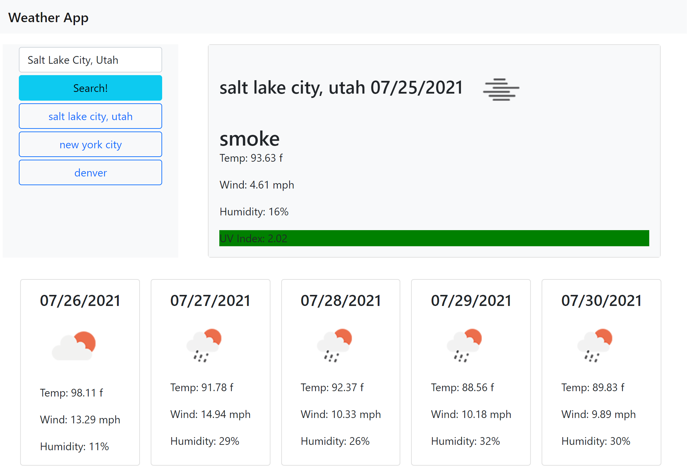

# weather-app

## Description
This website pulls up current weather and a 5 day forecast.

## Features
- Abiltiy to search a city for current conditions
- UV index will change color depending on the severity of the UV Index
- Search history persists with reloads or page leaves
- Search history becomes a clickable button to search again

## Bugs
- Search history buttons not working as intended

## Future Updates
- Futher mobile support

## Link to website
[Github Page](https://zunaty.github.io/weather-app/)

## Site Preview

### References 

- https://www.javascripttutorial.net/array/javascript-remove-duplicates-from-array/
- https://reactgo.com/javascript-get-last-n-elements/
- https://stackoverflow.com/questions/20943089/how-to-convert-unix-timestamp-to-calendar-date-moment-js
- https://getbootstrap.com/docs/5.0/getting-started/introduction/
- https://www.javascripttutorial.net/dom/manipulating/remove-all-child-nodes/